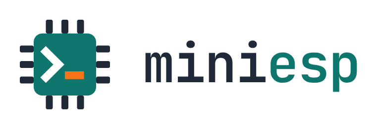
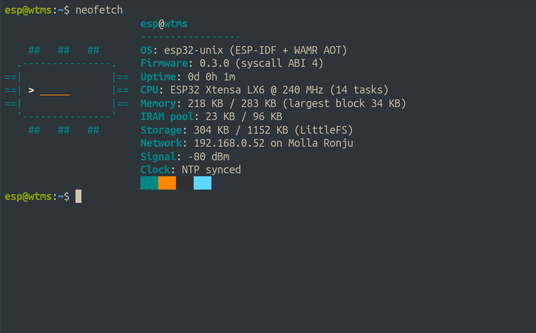
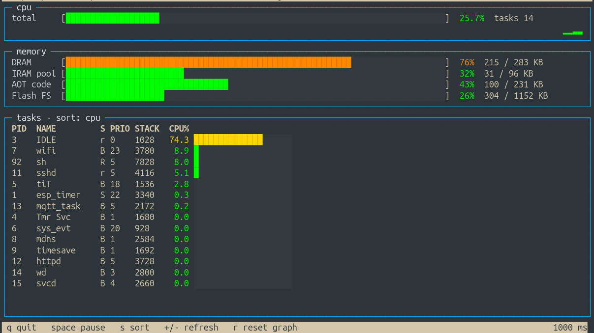

<p align="center"></p>

# miniesp


> New to this repo (human or AI agent)? `llms.txt` has the full flashing, toolchain and AOT-programming guide.
A tiny unix-like system for the **ESP32**, built on **ESP-IDF** (FreeRTOS):

- connects to a predefined WiFi network, or falls back to its own **access point**
- runs an **SSH server** (wolfSSH) with a Linux-style shell
- runs programs written in C, compiled to **WebAssembly** and then **AOT-compiled for Xtensa** with WAMR
- keeps programs and files in a **LittleFS** filesystem, with `/bin` as the program directory
- updates its own firmware **over the network** (OTA with automatic rollback), so USB is needed only once
- ships a **homepage** at `http://<board>/`, a small MQTT client, NTP time, a persistent key-value store and a service manager

```
you ──ssh──▶ sshd task ──▶ shell (pthread) ──▶ built-ins (ls, cat, ...)
                                          └──▶ /bin/*.aot  (WAMR AOT runtime, sys_* syscalls)
                                                         └── LittleFS (2.3 MB)
```

## Screenshots

<p align="center">
  <br>
  <em>An SSH login to the board: colored prompt and <code>neofetch</code> with the miniesp chip logo.</em>
</p>

<p align="center">
  <br>
  <em><code>btop</code>: CPU, memory pools (DRAM, IRAM, AOT code, flash FS) and the live task table, running on the ESP32 itself.</em>
</p>

## Quick start

Prerequisites (one-time): ESP-IDF v5.3.x, an ESP32 on USB, a 2.4 GHz WiFi network.

1. Put credentials in `../.creds/` (gitignored, one value per file, no extra newline needed):
   `wifi_ssid`, `wifi_password`, `esp32_ssh_password`, `esp32_ap_password` (8+ chars).
   The SSH host key (`esp32_hostkey.der`) is generated automatically on the first build.
2. Build and flash:
   ```
   . ~/esp/esp-idf/export.sh
   idf.py -p /dev/ttyUSB0 build flash      # firmware + a fresh LittleFS image from fs_image/
   ```
   **Warning: a full `flash` rewrites the filesystem, so anything you uploaded with `put` is lost.**
   For firmware-only updates that keep the files on the device, use `idf.py -p /dev/ttyUSB0 app-flash`.
3. Log in with the name, or the IP from the boot log (`idf.py monitor`):
   ```
   ssh esp@esp-minix.local        # or ssh esp@<ip>
   ```
   User `esp`, default password `esp32` (from `.creds/esp32_ssh_password`; change it with `passwd`).

### WiFi behaviour
| Situation | Result |
|---|---|
| SSID configured and reachable (15 s timeout) | station mode, DHCP address |
| No SSID, or cannot connect | access point **`miniesp`** (WPA2, password from `esp32_ap_password`), device at `192.168.4.1` |

Change the network from the shell: `wifi set <ssid> [password]` then `reboot`; `wifi clear` returns to the built-in defaults; `wifi scan` lists networks.

### Name and IP address (all configurable from the shell, stored in flash)
| Command | Effect |
|---|---|
| `hostname` | show the name; the device answers to **`<name>.local`** (mDNS) and sends it in DHCP. Default **`esp-minix`** |
| `hostname lab-1` | rename (a-z, 0-9, `-`); takes effect immediately |
| `ifconfig` | show mode, address, DHCP/static settings and the `.local` name |
| `ifconfig dhcp` | use DHCP (applied after `reboot`) |
| `ifconfig static <ip> <mask> <gw> [dns]` | fixed address, e.g. `ifconfig static 192.168.0.52 255.255.255.0 192.168.0.1` (DNS defaults to the gateway; applied after `reboot`) |

```
ssh esp@esp-minix.local
```
`.local` names work on Linux (with avahi/nss-mdns), macOS, iOS, Android 12+ and recent Windows. A name served by your router's own DNS (e.g. `esp-minix.lan`) cannot be set from the device: reserve the address in the router and add the record there. An invalid static config falls back to DHCP.

## The shell

You log in as **`esp`** (default password **`esp32`**, change it with `passwd`) and start in your home directory **`/esp`** (`~`).
`help` lists the built-ins: `ls cd pwd cat echo mkdir rmdir rm mv cp put sha256sum df free uptime ps uname hostname whoami ifconfig wifi passwd sleep clear reboot exit`.

- `ls -la` (also `-l`, `-a`) shows hidden files, permissions and sizes, sorted. `cd` alone goes home; `~` works in paths.
- Pipes and redirection work in the built-in shell too: `cmd1 | cmd2`, `< in`, `> out`, `>> out`, `2> err`, `2>&1`, and command lists `a ; b`, `a && b`, `a || b` (outside quotes).
- `rm [-rf] path...` refuses to remove `/` (the whole filesystem).
- Colors (terminal only): the prompt is green `user@host`, blue directory, and a red `$` after a failed command; `ls` shows directories in blue and `.aot` programs in green. Output sent to a pipe, a file or `ssh host "cmd"` stays plain.
- Line editing: Left/Right, Home/End, Delete, Backspace, Ctrl-A/E/U/L/D, and Up/Down history; text is inserted at the cursor.
- `grep [-vci]`, `head [-n N]` and `wc [-lwc]` are built into the firmware, so they work in pipelines and inside `sh`.
- Arrow-up history, backspace, Ctrl-U/L/D work. **Ctrl-C stops a running program.**
- Programs are `.aot` files, found in **`~/.local/bin`** (your own, searched first) and **`/bin`** (the system's). Run one by name: `hello`, `fib 30`, `ls /bin | grep aot | head -n 3`.
- `sh` starts a bash-like shell (see below).

| Path | Purpose |
|---|---|
| `/esp` (`~`) | your home directory |
| `/esp/.local/bin` | programs you install (starts empty) |
| `/bin` | system programs (flashed with the firmware) |
| `/etc`, `/tmp` | settings (`motd`), scratch space |

### Startup files
- **`~/.profile`** (`/esp/.profile`): run by the built-in shell at every interactive SSH login, after the motd. One command per line; blank lines and `#` comments are skipped. It is not run for `ssh host "cmd"`. Example: a line `neofetch` shows the summary at login.
- **`~/.shrc`** (`/esp/.shrc`): read by an interactive `sh` before its first prompt, same syntax as a `sh` script (variables it sets stay available). Not read for `sh script` or `sh -c`.
- Both ship as commented examples in `fs_image/esp/`; edit them with `put` (there is no editor).

### Run one command, copy files, install programs over SSH
```
ssh esp@esp-minix.local "uname"                                  # run a command; its exit status is passed back
ssh esp@esp-minix.local "cat ~/notes.txt" > notes.txt            # download
ssh esp@esp-minix.local "put ~/.local/bin/hello2.aot" < hello2.aot   # upload = install a program
ssh esp@esp-minix.local "sha256sum ~/.local/bin/hello2.aot"      # verify
```
There is no scp/sftp; `cat` and `put` over `ssh` do the same job. 200 KB files were verified bit-exact in both directions.

### Change the password (runtime)
```
passwd                  # asks: current, new, retype (nothing is echoed); stored as a salted, iterated SHA-256 hash in flash
passwd --reset          # back to the password built into the firmware
printf 'old\nnew\n' | ssh esp@host passwd     # non-interactive
```

## Web console

`http://<board>/` is the board's console: a Machine page (addresses with copy buttons, details, memory/program/storage meters, WiFi signal), a Services table and an Apps page (packages installed with `pkg`, with an Open button for apps that have a web UI, such as `wtms`). It reads two CGI programs: `/cgi-bin/sysinfo` (fast numbers, every 5 s) and `/cgi-bin/console` (firmware, clock, services, packages, programs; every 15 s). Light and dark themes follow the browser; the page is one self-contained file (`fs_image/www/index.html`, inline icons).

## Web hosting

The firmware runs an HTTP server on **port 80** (native C, on ESP-IDF's HTTP server; only the dynamic endpoints are AOT programs).

| URL | Serves |
|---|---|
| `/`, `/anything.ext` | files from **`/www`** (the image ships a board homepage `index.html` showing uptime, memory, storage and network; it polls `/cgi-bin/sysinfo`) (`/` and directories serve `index.html`); correct MIME types for html, css, js, json, images, text, wasm, ... |
| `/cgi-bin/NAME?arg+arg` | runs **`/www/cgi-bin/NAME.aot`** with arguments `arg arg` and returns its stdout |

```
ssh esp@host "put /www/index.html" < index.html          # publish a page
ssh esp@host "put /www/cgi-bin/hello.aot" < hello.aot    # publish a dynamic endpoint (build it like any program)
curl http://esp-minix.local/cgi-bin/NAME?arg+arg           # the program's stdout (JSON, text, ...)
```
A CGI program just prints its output. It may start with `Content-Type: text/csv` and a blank line (CGI style); otherwise JSON is detected by a leading `{`/`[`, everything else is `text/plain`.
Arguments may contain letters, digits and `_ . , : = @ / -` only; up to 24 words and ~600 characters, and the whole request line is limited to 240 characters (`CONFIG_HTTPD_MAX_URI_LEN`), so send big forms in pieces. A program that runs longer than 8 s is stopped (504). If an SSH program is running, a request waits ~1 s for its turn, then gets **503 busy** with `Retry-After` (so while `btop` or `sh` is open in a terminal, web requests that need the program runtime get 503 until you close it).
There is **no authentication** on port 80: use it on a trusted network.

`www` (shell command) shows the server status and URLs. With no `/www/index.html` the server shows a built-in placeholder page; the image ships the homepage and `sysinfo` as CGI; everything else you add. `programs/sysinfo.c` (system status as JSON) is a small example of a CGI program.

## Sonar (HC-SR04)

```
sonar            # distance 79.1 cm   (echo 4613 us, 2/3 samples)
sonar -j         # one line of JSON (handy for scripts and CGI)
sonar -n 0 -i 500    # keep reading every 500 ms until Ctrl-C
```
Pins from `BOARDS.md`: **trigger GPIO33, echo GPIO32** (`-t` / `-e` change them). The echo pin of an HC-SR04 is 5 V: use a voltage divider to the ESP32. The echo is timed with `sys_micros()`, and each reading is the median of several samples (WiFi interrupts can disturb single ones).

## Hardware drivers

Built-in commands and matching `sys_*` calls for programs (see `main/drivers.c`):

| Shell | Program call | Notes |
|---|---|---|
| `gpio 2 1`, `gpio 2`, `gpio 5 in` | `sys_gpio_mode/write/read` | pins 6-11 (flash) refused; 34-39 input-only |
| `adc 34` | `sys_adc_read(pin)` | ADC1 only (GPIO32-39), raw 0..4095 |
| `pwm 2 1000 25`, `pwm 2 off` | `sys_pwm(pin, Hz, permille)` | LEDC, 8 channels, 4 distinct frequencies, 1-40000 Hz |
| `dac 25 128` | `sys_dac_write(pin, 0..255)` | GPIO25 / GPIO26 |
| `i2c scan`, `i2c read 0x3c 2`, `i2c write 0x3c 0 1` | `sys_i2c_init/probe/write/read/wr` | default SDA 21, SCL 22, 100 kHz |
| - | `sys_uart_open/write/read/close` | UART 1 and 2 |
| - | `sys_micros()`, `sys_delay_us()`, `sys_pulse_in()` | microsecond timing |
| - | `sys_sonar_pulse(trig, echo, timeout)` | HC-SR04 echo width in us (native, precise) |
| - | `sys_ds18b20(pin)` | DS18B20 temperature in 1/100 degC |
| - | `sys_adc_mv(pin)` | calibrated millivolts |
| - | `sys_spi_open/xfer` | SPI master, 64 bytes per transfer |
| - | `sys_pcnt_open/read/clear` | hardware pulse counters (flow meters), 2 units |

## Services (systemd-like)

`service` (alias `systemctl`) manages background work:

```
service list                       # all services: type, state, boot setting, runs, last exit status
service status NAME                # details and the last log lines
service start|stop|restart NAME
service enable|disable NAME        # start at boot or not (persisted)
service log NAME                   # the service's output (RAM, timestamped by uptime seconds)
service new NAME --every 10 --output /www/x.log --desc "text" -- PROGRAM ARGS     # create a unit file
service rm NAME | service reload
```
* **Built-in services:** `sshd` (stopping it only stops *new* connections; your session stays open and `service start sshd` brings it back), `www`, `mdns`.
* **Unit files:** `/etc/services/NAME.service`, started at boot when `Enabled=true`:
  ```
  [Service]
  Description=Log the sonar distance every 10 s
  ExecStart=/bin/sonar -j -s 3                     # program + arguments (~/.local/bin and /bin are searched)
  Interval=10                                      # run every N seconds (timer style); 0 = run once / daemon
  Restart=no                                       # no | always | on-failure   (for Interval=0)
  RestartSec=5
  Output=/www/sonar.log                        # also append the output to this file (kept under 32 KB; /www files are served over HTTP)
  Enabled=true
  ```
  Example included (disabled): `heartbeat` (blinks the LED every 5 s).
* **Limit:** all programs share one runtime, so a service program holds it while it runs. Prefer `Interval=` services (they run briefly); a long-running daemon makes SSH programs and web requests wait for their turn.

`neofetch` prints a system summary next to the miniesp chip logo (firmware, uptime, CPU, memory pools, storage, network, clock); colors only on a terminal, and the logo is dropped on narrow terminals.

## `wtms`: water tank management (package)

A smart water tank manager (HC-SR04 level sensor, MQTT pump relay, Home Assistant discovery, web dashboard with login and settings). It is a **bundle package** (several files), installed with the package manager:
```
pkg update
pkg install wtms        # program + dashboard pages + CGI copy, all verified (SHA-256) and put in place
wtms setup              # interactive: web server port, dashboard password, MQTT broker/port/user, pump topic, tank size, pins, limits, time zone
wtms setup --headless mqtt_host=192.168.0.50 mqtt_pass=SECRET web_port=80 length=100 width=100 height=100 full_cm=15 [--start]
```
`wtms setup` validates everything first, saves the configuration (NVS keys `tank.*`, so an older install's settings are picked up), sets the MQTT broker, optionally moves the board's **web server to another port** (kv key `www.port`, applied with `service restart www`; port 22 is refused), creates the `wtms` service (every 5 s), checks the sensor and only starts pump control if you say so (`--start` / `start=1` in headless mode). It never starts the service by default. Headless keys: `mqtt_host mqtt_port mqtt_user mqtt_pass web_port web_pw tz start shape length width diameter height litres full_cm empty_cm` plus every `wtms config` key (`name pump ha trig echo temp on_pct off_pct max_run ...`).
CLI: `wtms status | read | config [k=v ...] | cmd reset|force_on[:min]|force_off[:min]|release | passwd NEW | discover`; dashboard `http://<board>[:port]/tank/`. `wtms` alone only prints usage. The package installs two builds of the same program: `wtms` (with `setup`, 58 KB) for you, and `wtmsd` (without `setup`, 40 KB) which the service and the web page (`/cgi-bin/wtms`) use, because a 58 KB program can fail to load while an SSH session has fragmented RAM (the dashboard login then answered "bad reply"). `pkg remove wtms` deletes the files and the service but keeps the settings in NVS and the data (`/www/tank/history.csv`). Details: `packages/wtms/README.md`.

### Bundle packages (for package authors)
A bundle is described by `packages/NAME/bundle.spec`; `tools/mkbundle.py packages/NAME` builds the program, copies the files to `pkgs/NAME/`, writes `pkgs/NAME/MANIFEST` (what `pkg install` downloads first) and the journal line `bundle NAME VERSION MANIFEST_URL sha256=... size=... abi=N`. Manifest lines: `dir PATH`, `file PATH URL sha256=.. size=..`, `copy SRC DEST`, `service NAME` (stopped and removed on `pkg remove`), `note TEXT`; paths must be under `/esp/`, `/www/`, `/etc/` or `/var/`. The whole manifest is validated before anything is written; files already present with the right hash are skipped, so `pkg install NAME` again (or `pkg fix`) repairs a damaged install.

## `ping` and `nmap` (packages)

`pkg install ping` / `pkg install nmap`. `ping [-c N] [-i SEC] [-W MS] [-s SIZE] HOST` sends real ICMP echo requests (new syscall `sys_ping`, **ABI 5**, so the firmware must be updated first) and prints each reply, the loss and min/avg/max round-trip time; Ctrl-C stops it with the summary. `nmap [-p PORTS] [-F] [-T MS] [-sn] [-v] TARGET...` is a small TCP connect scanner for a host name, an address, `a.b.c.1-50` or a CIDR block (/22 or smaller); "closed" means refused, "filtered" means no answer in the timeout. Only scan machines you own or may test.

## `nano` and `touch`

`nano FILE` (`programs/nano.c`, 18 KB) is a small nano-style editor; run it from a real terminal (`ssh -t`, or a normal interactive login). The whole file is held in RAM, so files up to ~39 KB. Keys: arrows, Home/End, PgUp/PgDn, Delete, Backspace, Tab, Enter; `^O` write out (asks for the name), `^X` exit (asks to save), `^K` cut line, `^U` paste, `^W` search (wraps), `^A`/`^E` line start/end, `^V`/`^Y` page down/up, `^C` show the cursor position, `^L` redraw. A lost connection leaves without saving. `touch FILE...` creates empty files (`-c` creates nothing; the filesystem has no timestamps).

## `btop`: system monitor (AOT program)

`btop` is a full-screen, btop-style monitor (`programs/btop.c`, 18 KB): total CPU usage with a history graph, memory bars
(DRAM, the IRAM program pool, AOT code memory, flash filesystem), and a live task table with per-task CPU%. The header shows
hostname, uptime, IP, WiFi network and signal, and the CPU clock. It adapts to your terminal size.

```
btop              # run it from the shell (needs a real terminal: ssh -t / a normal ssh session)
```
Keys: `q` or Ctrl-C quit, `space` pause, `s` change sort (cpu / stack / name / pid), `+` / `-` refresh rate, `r` clear the graph.

## `sh`: a bash-like shell (AOT program)

`sh` is itself a WAMR AOT program (`programs/sh.c`, 38 KB). Interactive use, scripts and one-liners:
```
sh                      # interactive (a "> " prompt continues multi-line if/for/while)
sh script.sh a b        # run a script; $0 $1 $2, $#, $@
sh -c 'ls /bin | wc'
```
Supported: pipelines (`a | b | c`), redirects (`< > >> 2> 2>&1`), lists (`; && || newline`), variables (`NAME=value`, `$NAME`, `${NAME}`, `$?`, `$#`),
quoting (`'..'`, `".."`, `\x`), command substitution `$(cmd)`, arithmetic `$((i+1))`, comments, and
`if/elif/else/fi`, `for x in ...; do ...; done`, `while ...; do ...; done`, `break`, `continue`,
builtins `cd exit export unset shift read true false : test [ source`.
Not supported: globbing (`*.txt`), functions, background jobs (`&` runs in the foreground), subshells.
**Inside `sh` only built-in commands can run** (`ls cat cp mv rm mkdir echo grep head wc ...`, see `help`): `sh` itself holds the one program memory, so starting another `.aot` program from a script (`hello`, `fib`, your own programs) fails with "not enough RAM to run a program inside a program". Run such programs from the normal shell instead, or use the built-in `grep`, `head` and `wc` in pipelines.
Ctrl-C stops the running command (and a running loop) and returns to the `sh` prompt.

```sh
#!/bin/sh
# count programs, then say hello 3 times
echo "programs: $(ls /bin | wc)"
i=0
while [ $i -lt 3 ]; do echo "hello $i"; i=$((i+1)); done
```

## `pkg`: package manager

`pkg update` downloads the journals listed in `/etc/pkg/sources.list` (default: `journals/main.journal` of this repo on GitHub, following `journal` links to other journals, max 16 journals / depth 3) and writes the merged list to `/var/pkg/index`; `pkg list [WORD]` shows it (`[i]` = installed), `pkg sources` prints the sources. `pkg` is part of the firmware image: if `/bin/pkg.aot` or `/etc/pkg/sources.list` is missing at boot (for example after the filesystem was wiped) it is written back automatically. `pkg install NAME` downloads, checks size, SHA-256 and `abi=` against the journal entry, and installs to `~/.local/bin`; `pkg remove NAME`, `pkg info NAME`. Installed names are also kept in the key-value store (`pkg.inst`), so `pkg fix` can reinstall them after the filesystem was lost (`pkg update` runs first if there is no index). Journal format: see `journals/main.journal`; `tools/mkjournal.sh DIR BASE_URL` prints `pkg` lines (with SHA-256 and size) for a directory of `.aot` files.
Downloads use the `sys_http_get(url, path, max_bytes, timeout_ms)` syscall (ABI 4: native HTTPS with the built-in CA bundle, so the clock must be set by NTP, and the repo must be public for `raw.githubusercontent.com`).

## Writing a program

Programs are C files in `programs/`, built **freestanding** (no libc; `mini.h` supplies everything). Write a normal `int main(int argc, char **argv)`:

```c
// programs/hello.c
#include "mini.h"
int main(int argc, char **argv)
{
    m_puts("Hello from WAMR AOT on the ESP32!\n");
    for (int i = 0; i < argc; i++) m_printf("  argv[%d] = %s\n", i, argv[i]);
    return 0;
}
```
The OS gives programs these **syscalls**:

| Call | Meaning |
|---|---|
| `sys_read(fd, buf, n)` / `sys_write(fd, buf, n)` | fd 0 = input (the keyboard: one edited line; or a pipe/file), 1 = output, 2 = errors, 3+ = streams you opened |
| `sys_open(path, mode)` / `sys_close(fd)` | mode 0 read, 1 write (truncate), 2 append; relative paths use the shell's directory |
| `sys_getcwd`, `sys_chdir`, `sys_stat` | working directory; `sys_stat` = 1 file, 2 directory, -1 missing |
| `sys_run(blob, len, argc, in, out, err)` | run another command (built-in or program) and wait; this is how `sh` is written |
| `sys_membuf`, `sys_rewind` | in-RAM streams (pipes) |
| `sys_isatty`, `sys_sigint` | is this a terminal; catch Ctrl-C instead of dying (used by shells) |
| `sys_millis`, `sys_sleep_ms` | time since boot; sleep (interruptible) |
| `sys_sysinfo(SI_*)`, `sys_netinfo`, `sys_tasks` | memory pools, uptime, WiFi signal, CPU clock, terminal size; host/IP/SSID; per-task CPU% (used by `btop`) |
| `sys_getkey(ms)` | one raw key with a timeout (full-screen programs); -3 = Ctrl-C |
| `sys_gpio_mode/write/read` | drive real pins |
| `m_puts`, `m_printf` (`%s %d %u %x %c`), `m_atoi`, ... | tiny helpers |

Examples: `hello`, `fib` (CPU benchmark), `greet` (reads input), `wc`, `grep`, `head` (all read stdin or files, so they work in pipes), `blink` (GPIO), `sh`, and `btop`.

Build them (output goes to `fs_image/bin/`, flashed with the firmware):
```
programs/build.sh            # all programs
programs/build.sh hello.c    # one program
```
or build one and install it without reflashing: `ssh esp@host "put ~/.local/bin/x.aot" < fs_image/bin/x.aot`.

### Toolchain needed for `build.sh` (one-time)
1. **wasi-sdk** (clang for wasm): download a release into `~/esp/tools/wasi/`.
2. **`wamrc` with the Xtensa backend.** The prebuilt `wamrc` releases do **not** include Xtensa; build it from the same WAMR release tag as the runtime (2.4.5):
   ```
   git clone --branch WAMR-2.4.5 https://github.com/bytecodealliance/wasm-micro-runtime ~/esp/wamr
   cd ~/esp/wamr/build-scripts
   CXXFLAGS="-include cstdint" python3 build_llvm.py --platform xtensa --arch X86 Xtensa   # ~40 min
   cd ../wamr-compiler && mkdir build && cd build && cmake .. && make -j8
   ```
   (`CXXFLAGS=-include cstdint` is needed with recent GCC. Set `WAMRC=` / `WASI_SDK=` if installed elsewhere.)

### Things worth knowing (hard-won)
- **Use `--size-level=0` when AOT-compiling for Xtensa** (the default in `build.sh`). Other levels leave the literal pool unrelocated and the code crashes at its first function.
- **Freestanding programs are 5-8x smaller** than wasi-libc ones (`hello`: 3 KB of AOT instead of 30 KB). That matters: AOT code and the program file live in the ESP32's scarce RAM.
- **Memory model.** Each program needs a 64 KB linear memory, and only **one** such memory exists: a slot reserved in DRAM at boot (an SSH session fragments DRAM, so it has to be reserved before anything else). A second slot in IRAM is attempted at boot but cannot be created on this chip: the IRAM pool is 98.8 KB in total, but its largest free block is 62 KB (63,488 bytes), less than the 64 KB (65,600 bytes) a slot needs. `free` shows the state (`Slots: DRAM free, IRAM missing`). So **one program runs at a time and a program cannot start another program** (see below). Large program files are held in the IRAM pool (or in DRAM when that is full); keep programs small. Check with `free`.
- **One program at a time:** SSH commands, web CGI requests and services take turns on the runtime (a lock). Web requests wait ~1 s, then get 503; SSH commands wait up to 10 s.
- The firmware runs **single-core** (`CONFIG_FREERTOS_UNICORE`): IRAM can only be used as byte-accessible memory in that mode.
- WASI directory access does not work on ESP-IDF, which is why files go through `sys_open`.
- Ctrl-C works whenever the program calls into the OS (`sys_*`); a tight loop that never calls it cannot be interrupted.
- The terminal size comes from the client's pty request (read from wolfSSH's session struct, because its resize-callback API is not built on ESP).
- wolfSSH is patched at configure time (`main/CMakeLists.txt`) so a client closing its stdin does not make the server stop sending output.

## Layout
```
main/            firmware: ota, timesync (SNTP), kv (NVS store), mqtt (client + cache), wifi_mgr, ssh_server, www (web server), svc (services), drivers (gpio/adc/pwm/i2c/...), shell, term (line discipline), io (streams), auth, aot_run (WAMR + sys_*), fs, tty_vfs
programs/        C sources + build.sh + mini.h
fs_image/        becomes the LittleFS partition (bin/, etc/ + etc/services/, tmp/, esp/ = home with .local/bin, www/ = web root)
partitions.csv   4 MB flash: nvs, otadata, two 1.4 MB app slots (OTA), LittleFS 1.1 MB
tools/ota.sh     network firmware update
```

## Contributing
Contributions and co-maintainers are welcome: see `CONTRIBUTING.md` (including the port checklist), `MAINTAINERS.md`, `BOARDS.md` (pins and tested boards) and `docs/PACKAGES.md` (write and publish a package in about 10 minutes). Good first issues are labelled on GitHub.

## Known limits
- **One SSH session at a time.** A second client waits until the first disconnects (RAM is the constraint).
- **AP mode does not retry the network.** If the router was down when the device booted, it stays in AP mode until rebooted (`reboot` over the AP, or power-cycle). The AP and SSH-over-AP are verified up to "broadcasting and listening", not with a full login from a client.
- The web server (port 80) has no authentication.
- Password authentication only (default `esp32`, which is weak: change it with `passwd`); no public keys, no scp/sftp.
- Programs cannot be interrupted while they sit in a loop that never calls a `sys_*` function.
- **A program cannot start another program** (for example `sh` running `hello` or `fib`): a second 64 KB program memory does not fit in RAM (the IRAM pool has no 64 KB contiguous block, and the DRAM slot is taken by the first program). Inside `sh`, built-in commands (`ls cat grep head wc echo ...`) work; other `.aot` programs print "not enough RAM" there. Run them from the normal shell instead.
- A program's file is held in memory while it runs, so keep programs small (a few KB is typical; `sh` is 38 KB).
- Uploads run at roughly 30 KB/s; 200 KB files verified bit-exact (SHA-256), in both directions.

## Security notes
- Password authentication only, a single account, no TLS-style rate limiting beyond a 1.5 s delay per failed attempt. Use it on a trusted network.
- Credentials are baked into the firmware image at build time from `.creds/`. Anyone with a flash dump of the device can read them.
- wolfSSL/wolfSSH are **GPLv3** (or commercial). A firmware image that includes them is a GPL combination if you distribute it.

## Updating without USB (OTA)
The first flash must be over USB (it writes the OTA partition table). After that:
```
idf.py build
tools/ota.sh 192.168.0.52            # ssh "ota --sha256 ..." < build/esp32_unix.bin ; ~1 min
ssh esp@host "ota status"            # running slot, version, valid / pending verification
ssh esp@host "ota rollback"          # go back to the previous image
```
After the board is back, `tools/ota.sh` runs `tools/sync.sh`: it copies programs from `fs_image/` that are missing or different (`/bin/*.aot`, the sysinfo CGI), restores missing config files (motd, pkg sources, service units, `~/.profile`, `~/.shrc`, the homepage) without overwriting yours, and runs `pkg fix` (`NO_SYNC=1` skips it). An OTA only replaces the firmware, not the filesystem.
The board writes the other slot, checks the SHA-256, switches and reboots. A new image is "pending verification" and is confirmed once WiFi and sshd are up (~60 s); a crash or watchdog reset before that makes the bootloader fall back to the old image (the rollback path itself has not been exercised on hardware).
Notes: the update is written with sequential erases (an up-front erase of 1.4 MB starves the idle task and trips the watchdog); hardware SHA is disabled (`CONFIG_MBEDTLS_HARDWARE_SHA=n`) because the hardware engine aborted while an image was streaming in. Changing `partitions.csv` again needs a USB flash and wipes the filesystem.

## Syscalls (ABI 5): change programs without reflashing
Application changes never need firmware: rebuild the `.aot` and `put` it. `programs/mini.h` declares every syscall (`sys_abi()` returns 5): files (unlink/mkdir/rmdir/rename/fsize/listdir/seek), TCP/UDP sockets and DNS (as fds), time (`sys_time/localtime/tz`, NTP), persistent key-value store (`sys_kv_*`, NVS), MQTT (`sys_mqtt_*`, native client with a subscription cache), random, reboot, log, version, plus the drivers above. Only a *new* syscall needs a firmware update (OTA).

Shell commands added with it: `date`, `tz`, `ntp`, `kv list|get|set|del`, `mqtt status|config|start|stop|pub|sub|unsub|cache`, `ota`. Native services: `sshd www mdns mqtt watchdog`.

## Your own programs and services (start here)
This is a fresh project: add `.aot` programs and services without touching the firmware.
1. Write `programs/NAME.c` (`#include "mini.h"`, see `programs/hello.c`, `programs/sonar.c`, `programs/wc.c`), then `cd programs && ./build.sh NAME.c` (output `fs_image/bin/NAME.aot`; use `OUT=somewhere ./build.sh` to keep it out of the firmware image).
2. Install on a running board, no flashing: `ssh esp@HOST "put ~/.local/bin/NAME.aot" < NAME.aot`, run it as `NAME`.
3. Make it a service: `ssh esp@HOST "service new mysvc --every 30 --desc 'My thing' -- NAME args"`, then `service enable mysvc` and `service start mysvc` (see the Services section; unit files live in `/etc/services`).
4. Web: put pages in `/www`, dynamic endpoints in `/www/cgi-bin/NAME.aot`. Settings that must survive reboots: `sys_kv_*` (NVS). MQTT, sockets, time, GPIO/I2C/SPI/ADC... are all syscalls (`programs/mini.h`).
5. Firmware only changes when you add a syscall or native feature: `idf.py build && tools/ota.sh HOST`.

Credentials: `.creds/` (gitignored) holds `wifi_ssid`, `wifi_password`, `esp32_ssh_password`, `esp32_ap_password` and the SSH host key; they are baked into the firmware at build time. First flash over USB: `idf.py -p /dev/ttyUSB0 flash` (writes the OTA partition table); afterwards use OTA.
